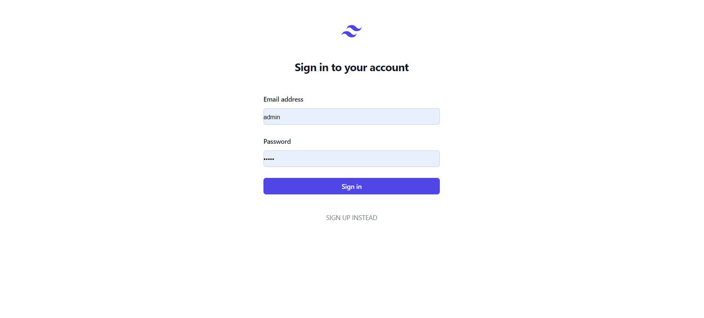
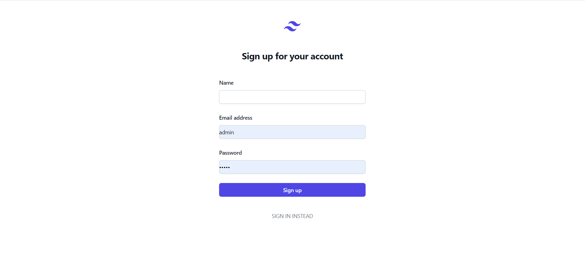
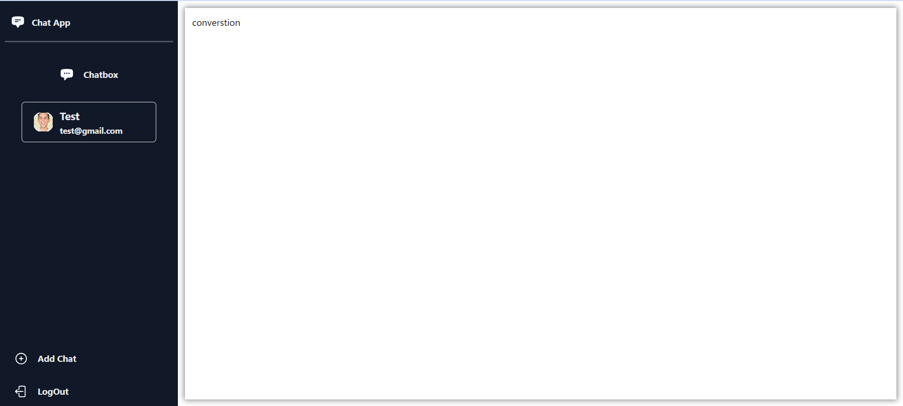
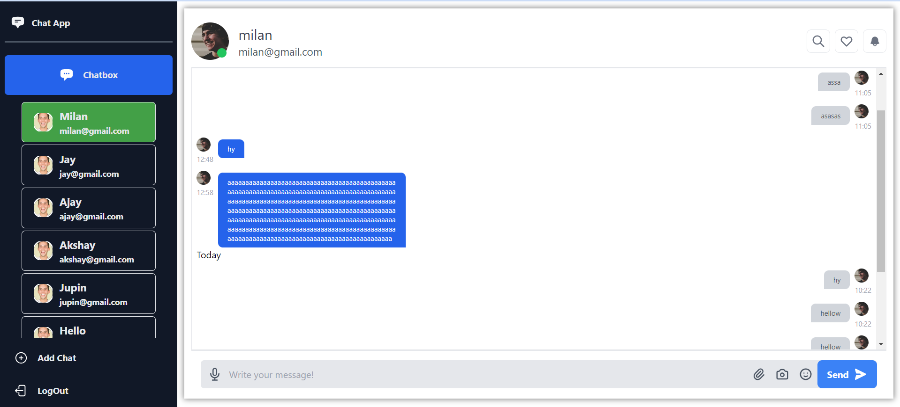

# chatapp
chatapp

## Available Scripts

In the project directory, you can run:

### `npm run setup`

Install nodemodules client and server 

### `npm run start-server`

This Commond is run the server in port:[3035](http://localhost:3035)

check server working or not open this link [http://localhost:3035/health]

### `npm run start-client`

Runs the app in the development mode.\
Open [http://localhost:3000](http://localhost:3000) to view it in your browser.

The page will reload when you make changes.\
You may also see any lint errors in the console.

